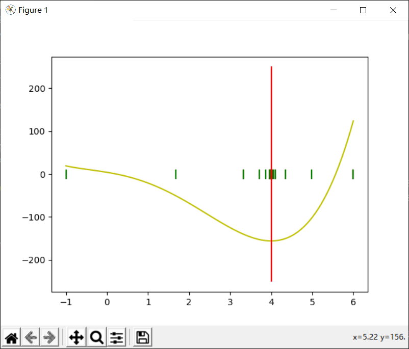
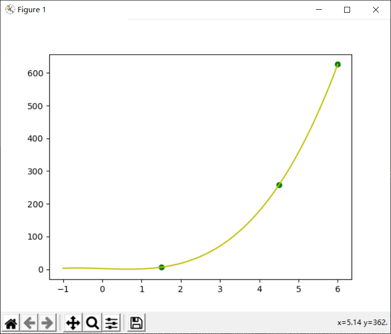
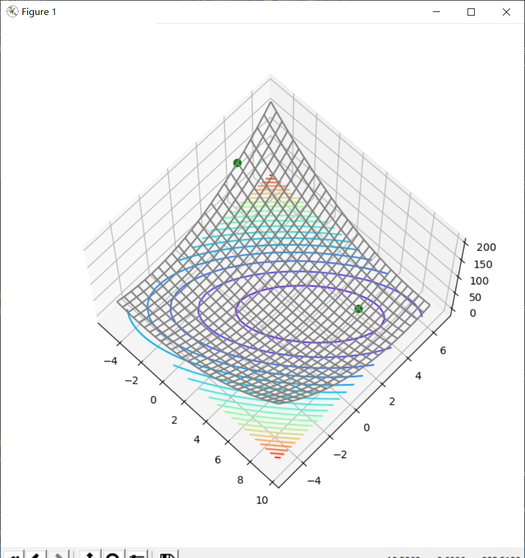
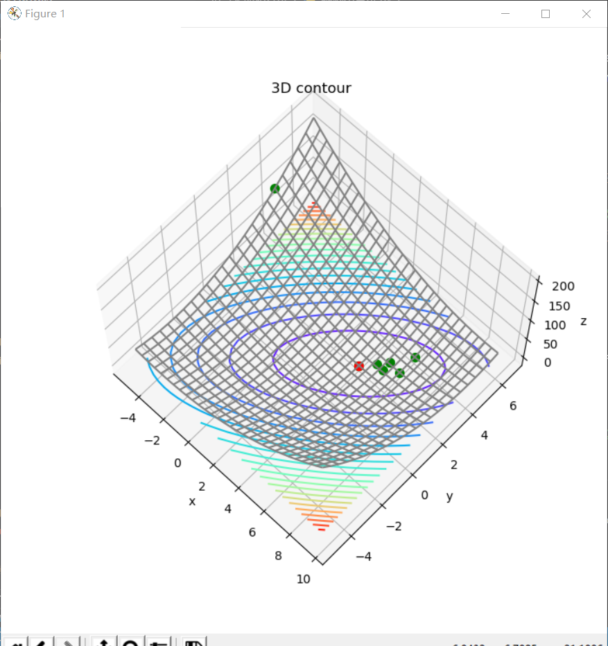
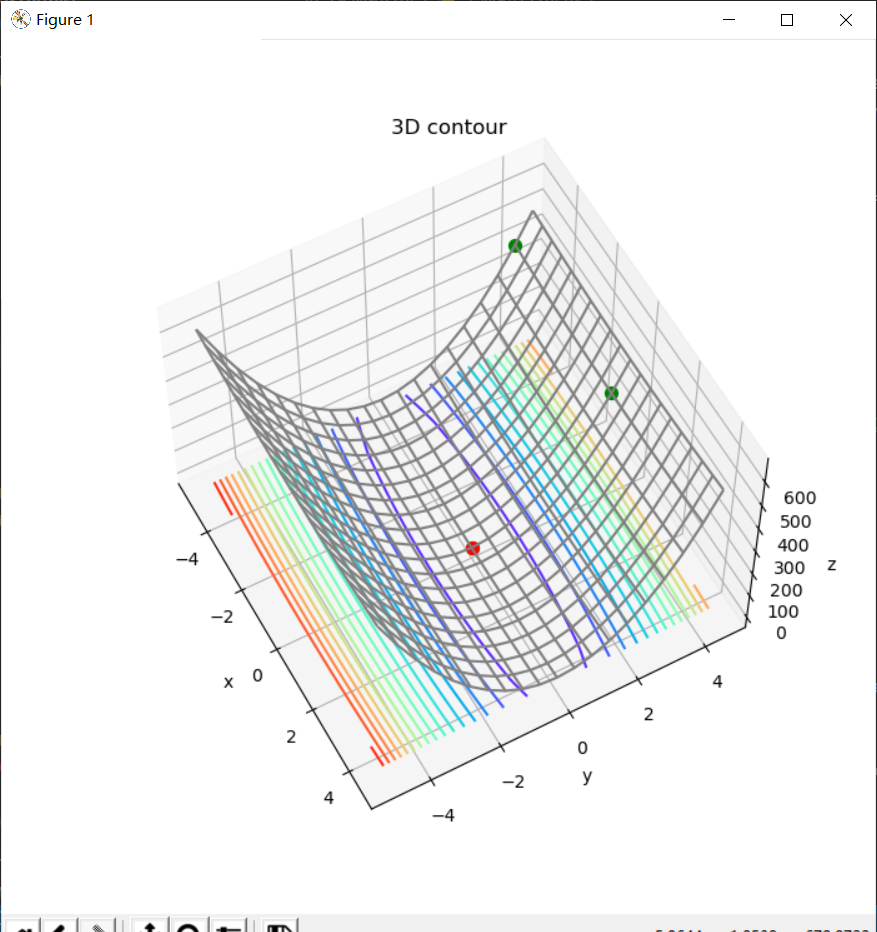
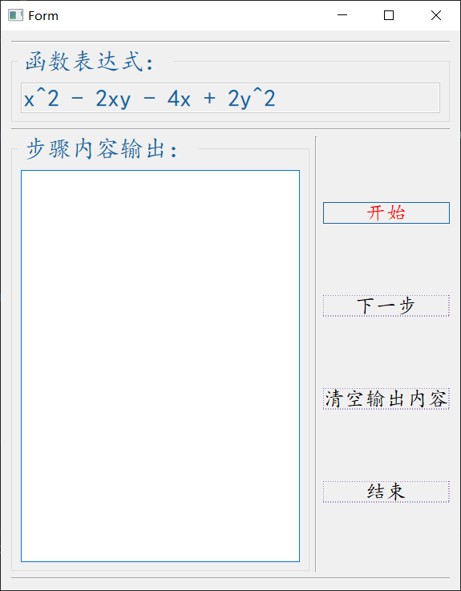
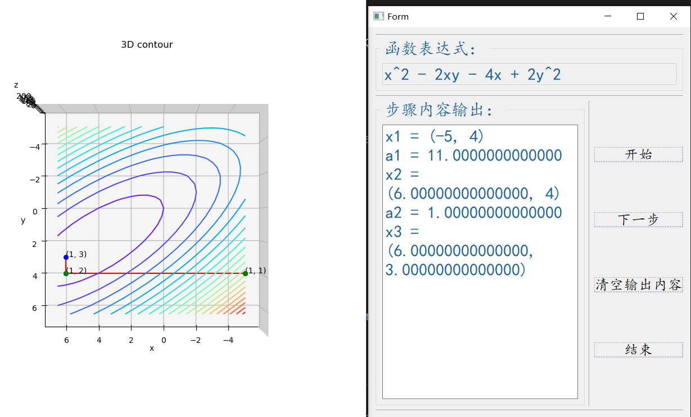
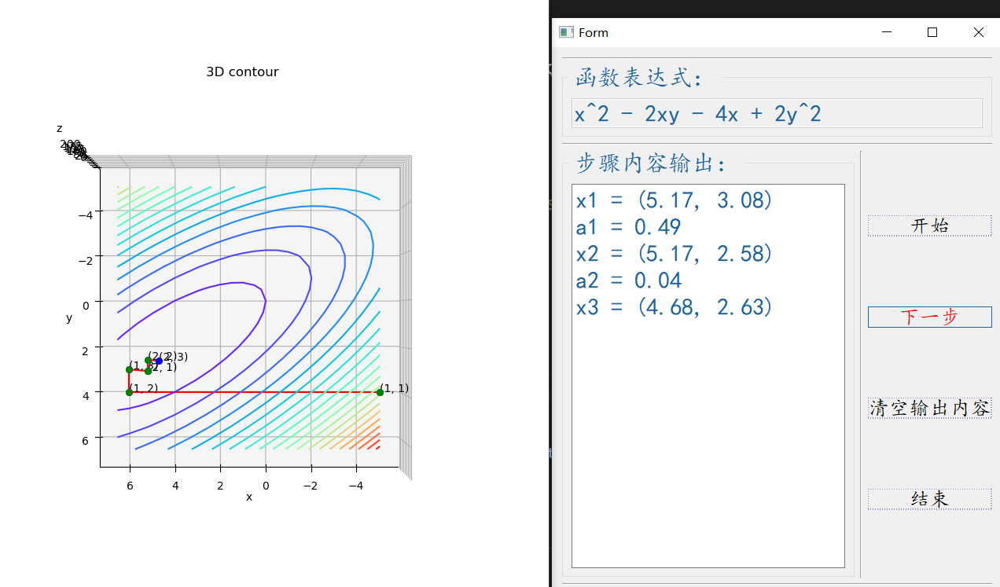
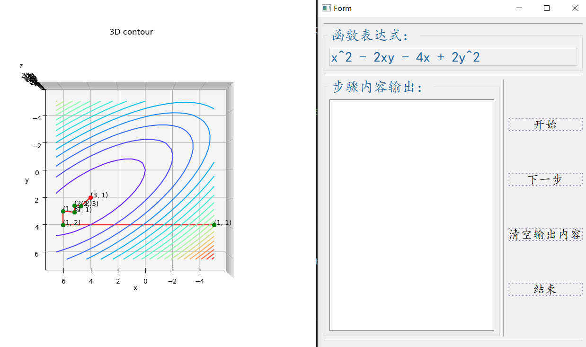

# Method-of-optimization
最优化方法源码：有常见的一维线性搜索方法，如：成功失败法、线性插值法、二分法、牛顿法等；有无约束优化方法，如：DFP变尺度算法、鲍威尔算法、共轭梯度法、牛顿型方法、坐标轮换法、最速下降法等；有一个基于designer设计的单步演示鲍威尔算法的动画UI界面，助理解鲍威尔算法，运行UI.py文件即可。

## 部分算法演示示图

黄金分割算法演示示图：

成功失败算法演示示图：

鲍威尔算法演示示图：

坐标轮换算法演示示图：

带UI界面的鲍威尔算法演示示图：

在运行UI.py文件之后，将这个弹出的UI界面拖到稍微靠右一点的位置，因为这个带UI界面的单步演示的算法效果有一个bug，即不能拖动点击【开始】按钮之后弹出来的三维俯视图，拖动即报错，结束进程。

